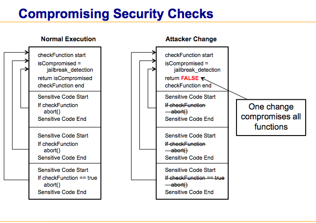
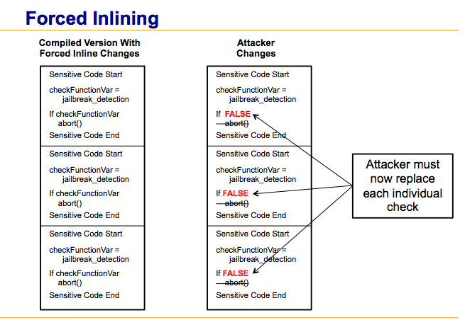

# Background

The "iMAS forced-inlining" tutorial provides guidance on defending applications from memory editing and program patching attacks. These attacks can be used to get around sensitive code areas such as authentication checks, jailbreak detection, etc.  In the nominal case an attacker must only find the one place a security check happens and modify if it is actually called, or what it returns. But by using the proper compiler directives and build settings we can force these checks to appear multiple places in the resulting instruction set. Now an attacker must actively find and patch every place a check occurs to bypass a given security mechanism.

This has been coupled with other iMAS controls, such as [security-check](https://github.com/project-imas/security-check), to help bolster a given application's overall resilience.  The [Remail-iPhone](https://github.com/project-imas/Remail-iPhone) application also has these techniques integrated into a real application, to demonstrate practical usage.
 
# Technical Overview

Inlining functions can be a very effective method of duplicating sensitive code. Duplicating code means that attackers are forced to work harder and spend more time finding and altering this code, and have a higher chance of accidently altering critical sections.  For example, placing jailbreak detection code
in multiple places throughout an app make it much more difficult for an attacker to simply find the one "exit"
call and overwrite it with a "NOOP".  

Modern compilers do several levels of optimization, and much of it is opaque to the end developer.  
Some optimizations combine redundant code into a single set of instructions, and move the pointer on 
the execution stack to that block as needed.  This is normally a good thing that leads to smaller 
executables, faster programs, etc.  But there from a security perspective an attacker now only has 
to find where that set of code returns and overwrite it.

Code example:

    int cleverTest() {
       // Code that tests if something bad has happened
       return result;
    }
   
    int importantCode1(){
       if(cleverTest()) exit -1;
       // Do sensitive things
    }
   
    int importantCode2(){
       if(cleverTest()) exit -1;
       // Do sensitive things again
    }
   
Even though cleverTest() is referenced multiple times, a determined attacker only has to find where in memory "cleverTest" is called and null it out, or set a constant return value.   

This tutorial walks through the compiler flags and directives involved, as well as providing a sample xcode project that enforces code redundancy.  So the compiler will put in the same code at multiple points.

# Inline functions

The main trick to be aware of is the **\_\_attribute\_\_((always_inline))**  compiler directive.  Adding this to a function *almost always* forces it to be inline.  There are some gotchas that may cause it not to be honored that include:
  * -finline-limit: This compiler flag specifies how large, in number of instructions, an inline function can be.  Set this high to ensure inlining of your custom code.
  * Optimization: Use at least **-O1**.  Some compilers will not honor always_inline with no optimization set, since they consider all inlines a form of optimization.  
  * -unit-at-a-time: Avoid using this.  Considers information from later function calls in order to reduce the size of current ones during compile time.  This is automatically used at **-O3** and above.
  * -keep-inline-functions: Avoid using this if your functions are static.  Forces them to be compiled out to their own obj file.

Another note is that you only need to put the directive on the declaration for the function, not the definition. For example:

foo.h
  
     inline void your_function() __attribute__((always_inline));

foo.c
     
     void your_function() {
       /* Actual implementation*/ 
     }

# Macros

Macros have much less restrictions than inline functions.  Keeping the optimization level low (Anything 
below **-O3**) has seemed to prevent any optimizations that result in merged macro code. If you have only 
macros you want made redundant then **-O0** is the safest option, since it prevents any optimization from 
occuring.  In general though **-O1** should be fine, and allows you to force macros to be inline.

# Padding

Note that padding occurs in final executables, so you may not see a jump in resulting file size 
for extra calls to inline functions or macro expansions.  The file size increase should be porportional 
though to the amount of additions.  i.e. if it only jumps by 4 bytes for a large inline function something 
is wrong.  This is covered more in the sample project files and sections of this readme.

# Summary of Xcode settings

The following settings have had good success in Xcode for enforcing redundant code segments:
 * **inline YOUR_FUNCTION \_\_attribute\_\_((always_inline))** in declaration (C style functions only)
 * Project Build Settings:
  * Other C Flags: -finline-limit=5000
  * Compiler for C/C++: LLVM GCC 
  * Optimization Level: Fast [-O, O1]

# Note on the LLVM Compiler

Clang's (Apple's default LLVM compiler) does not support inline related flags (Such as finline-limit).  It can still be used to force redundany, but additional testing should be done to make sure always_inline is being honored.  One way to do this is to move relevant sections of code to their own standalone .c and .h files and compile with the assembly flag (-S) on.  

An example program is provided in the **assemblyComparison** directory. The **compile.sh** script contains all the relevant compile options for both clang and gcc. 

Below is a side-by-side comparison of the gcc assembly instructions generated, showing where an attacker must patch or null out in memory to avoid detection.

# Compiler-redundancy Project

The included project gives an example of an Xcode project with the appropriate build settings.  It also partially demonstrates that code redundancy is occurring based on file size of output.  In **AppDelegate.m** there are two commented out define statements:
 * #define MANY_MACROS
 * #define MANY_INLINES

Uncommenting either or both of these will cause the resulting file size to grow (Actual sizes dependant on the target).  For example, when MANY_INLINES is defined, instead of 2 instances of *unoptimizable* being called, 7 are.  The function *unoptimizable* is crafted to avoid basic compiler optimizations, and have a large instruction footprint.  As a result the executable will jump by roughly 4kb from just the five new calls.

These results can also be verified on the command line by outputting assembly instead of executable files.

